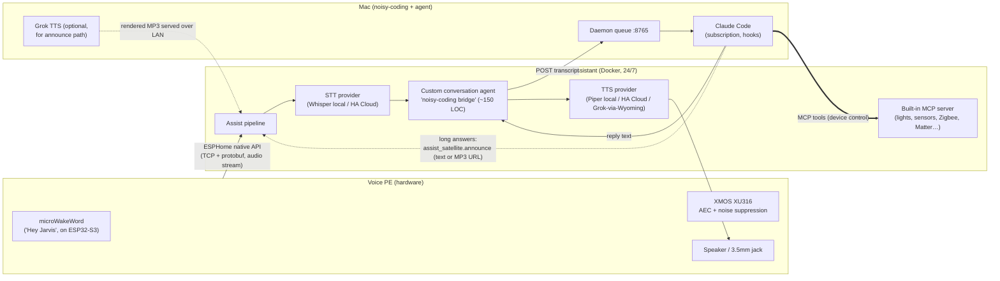
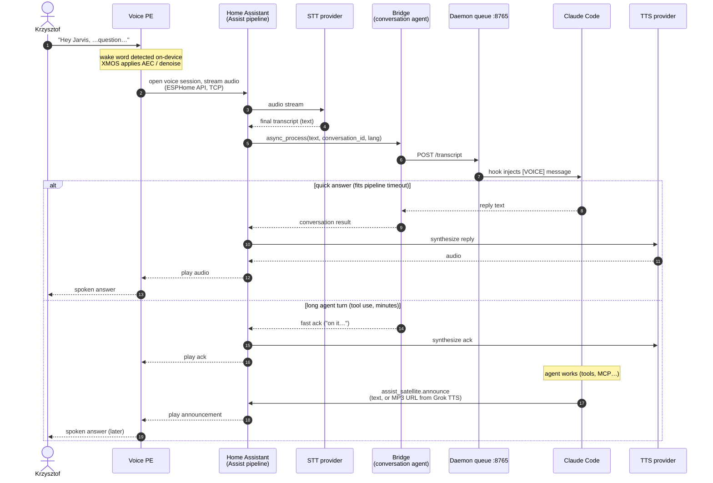
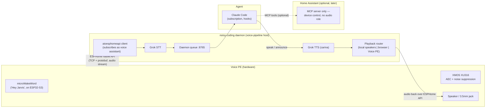
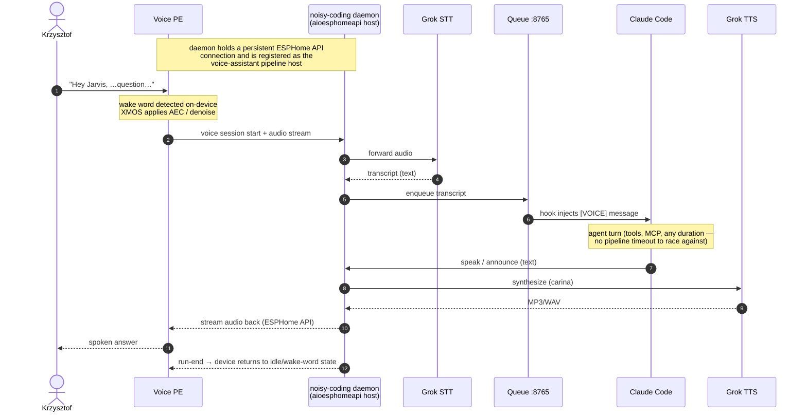

# Voice PE integration — two candidate architectures

How to hook the **Home Assistant Voice Preview Edition** speaker into the
noisy-coding / Claude Code voice system. Two candidate designs:

- **Architecture A — "default"**: the speaker is paired with Home Assistant the way
  Nabu Casa intended; HA owns the audio pipeline (STT/TTS) and hands *text* to a
  thin bridge plugged into its conversation-agent slot.
- **Architecture B — "direct"**: no HA in the audio path; the noisy-coding daemon
  speaks the ESPHome native API itself (via `aioesphomeapi`) and owns STT/TTS.

In **both** designs the brain is the same: Claude Code running on the
subscription (no per-token API billing), fed through the daemon queue on
`:8765`. Home Assistant, when present, is additionally exposed to the agent as
an **MCP server** for device control — that part is identical in A and B and
independent of the audio path.

---

## Architecture A — speaker paired with Home Assistant (default)

### Components

### Utterance flow (sequence)

### Notes

- **Speaker ↔ HA transport is not HTTP**: persistent TCP with protobuf
  (ESPHome native API); audio is streamed over it after wake-word detection.
- **STT/TTS are pluggable pipeline providers** (Wyoming protocol = simple TCP,
  runs as sidecar containers). No ready-made Grok STT provider exists; wrapping
  Grok in Wyoming is ~150 LOC if ever needed.
- **Language / engine switching by voice**: pipeline settings are HA config;
  the satellite exposes a `select` entity choosing the active pipeline. The
  agent flips it via MCP ("switch to English" → next utterance uses the other
  pipeline).
- **Voice identity**: the synchronous reply path uses the pipeline TTS voice
  (e.g. Piper), *not* Grok's carina. The announce path can carry ready-made
  Grok MP3s, so the daily-driver voice can stay consistent there.

---

## Architecture B — daemon talks to the speaker directly (no HA in audio path)

### Components

### Utterance flow (sequence)

### Notes

- The daemon takes the seat HA normally occupies: **one** voice-assistant host
  per device. `aioesphomeapi` is the same official library HA itself uses.
- Wake word still runs **on the device** (microWakeWord) — no cloud, no HA
  needed for it.
- STT/TTS stay on the existing Grok stack → the speaker becomes just another
  audio backend next to the Mac speakers and the planned browser-tab device;
  one consistent voice (carina) everywhere.
- Everything the "default" design gets for free must be owned here: session
  state machine, reconnects, timers/announce semantics, firmware update flow
  (still possible via ESPHome tooling, just not one-click).
- HA can be added **later** purely as an MCP device hub — nothing in the audio
  path changes.

---

## Barge-in (interrupting the assistant mid-sentence)

The hardware is ready for it in both designs: the XMOS chip cancels the
speaker's own output from the mic signal (AEC), so the device can genuinely
hear the user **while it is talking**. What differs is what the software layer
lets you do with that:

| | A — via HA (stock firmware + pipeline) | B — direct |
| --- | --- | --- |
| Say **"Stop"** mid-playback | ✅ dedicated on-device model, works out of the box | ✅ same on-device model (stock firmware) |
| Say the **wake word** mid-playback to cut in with a new command | ✅ ("Hey Jarvis, actually…") | ✅ |
| **Arbitrary** barge-in — any speech interrupts and becomes the new utterance | ❌ not supported by the stock Assist pipeline | ✅ achievable: custom ESPHome firmware streams the mic continuously; the daemon runs VAD on it (AEC already removed the echo) and kills playback when real speech appears |
| Effort | none (but hard ceiling) | custom firmware YAML + daemon-side VAD gate (the same barge-in model as the planned browser-tab audio device) |

So: **fully natural "wejść w słowo" conversation is only reachable in B** (or
in a hybrid where the speaker's audio is re-pointed at the daemon), because it
requires owning the mic stream during playback. With stock HA the interrupt
vocabulary is fixed: "Stop" and the wake word.

---

## Side-by-side

| Aspect | A — via HA | B — direct |
| --- | --- | --- |
| Audio plumbing | HA Assist pipeline (battle-tested) | own code on `aioesphomeapi` |
| New code to write | bridge ~150 LOC (+ optional Wyoming Grok TTS) | pipeline host in daemon (bigger, ongoing) |
| STT | Whisper local / HA Cloud (flat fee) | Grok STT (existing stack) |
| TTS / voice identity | pipeline voice (Piper…), Grok only via announce | Grok carina everywhere |
| Reply latency model | timeout-bound sync path + async announce | no timeout, native async |
| Barge-in | "Stop" / wake word only | arbitrary speech (with custom firmware) |
| Survives Mac being asleep | basics yes (HA runs 24/7); brain no | no (daemon *is* the host) |
| Multi-room satellites | trivial (HA manages fleet) | daemon must manage fleet |
| HA as MCP device hub | same in both — independent of audio path | same in both |
| Dependency on HA | required, 24/7 | none |
